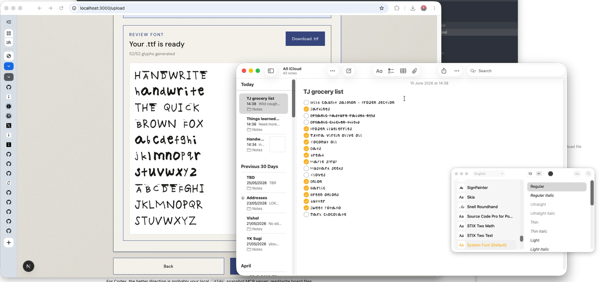

# HandWrite

[](./public/handwrite-preview.mov)

[Watch the HandWrite preview](./public/handwrite-preview.mov)

HandWrite turns a clear photo of handwritten letters into a downloadable TrueType font. The app guides someone through uploading an alphabet sample, analyzes the photo with Gemini, traces the detected glyphs in the browser, and exports a `.ttf` file for review and download.

## What It Does

- Accepts phone photos, including common formats such as JPEG, PNG, WEBP, HEIC, and HEIF.
- Normalizes uploads to JPEG before analysis.
- Uses a stateless Next.js API route to ask Gemini for alphabet glyph locations.
- Generates the font in a Web Worker so tracing and OpenType serialization do not block the upload UI.
- Supports uppercase and lowercase glyph extraction when both are present.
- Shows a font preview only after a real `.ttf` has been generated.

## Tech Stack

- Next.js 16 App Router
- React 19
- TypeScript
- Tailwind CSS 4
- Bun
- Gemini API through `@google/genai`
- `opentype.js` for font creation
- `imagetracerjs` for raster-to-vector tracing

## Getting Started

Install dependencies:

```bash
bun install
```

Create `.env.local` and add a Gemini API key:

```bash
GEMINI_API_KEY=your_api_key_here
```

Run the development server:

```bash
bun run dev
```

Open [http://localhost:3000](http://localhost:3000).

## Scripts

```bash
bun run dev      # Start the local development server
bun run build    # Create a production build
bun run start    # Start the production server
bun run lint     # Run ESLint
bun run test     # Run Bun tests with the project test setup
```

## Project Structure

```text
src/app/
  page.tsx                    Home page
  upload/                     Upload, analysis, generation, and review UI
  api/extract/analyze/        Stateless Gemini analysis route

src/lib/extraction/           Gemini response schemas and extraction constants
src/lib/font/                 Glyph tracing, font generation, and worker code
src/lib/images/               Upload normalization helpers
src/lib/server/               Server-only environment helpers
src/test/                     Test setup
```

## How The Flow Works

1. The user uploads a photo of handwritten alphabet samples.
2. The browser checks the file type and size, then normalizes the image to JPEG.
3. The `/api/extract/analyze` route sends the image bytes to Gemini.
4. Gemini returns structured glyph detections validated by local schemas.
5. The browser starts a Web Worker to clean glyph masks, trace paths, and build a `.ttf`.
6. The UI displays the generated font preview and download action.

## Notes

- The app does not persist uploads or generated fonts.
- `GEMINI_API_KEY` stays on the server and is never exposed to browser code.
- Font fidelity depends on the photo: clear lighting, dark ink, and separated letters produce better glyphs.
